# Webprogrammierung I 

###### Autor: **Johannes Koch (Mtr.Nr. m22571, Mail: [u30394@hs-harz.de](www.u30394@hs-harz.de))**
###### Dozent: **Michael Wilhelm (Mail: [mwilheln@hs-harz.de](www.u30394@hs-harz.de))**
###### Abgabedatum: 30.09.2017
###### Code: [github.com/Joringel/webprog](https://github.com/Joringel/webprog)
###### Lizenz: Dieses Projekt wird unter der MIT-Lizenz lizenziert. Details unter [doc/LICENCE.md](/doc/LICENCE.md)
<br>
Die Abgabe ist im Rahmen des Fachs: *Webprogrammierung* an der [Hochschule Harz](https://www.hs-harz.de/studium/fb-automatisierung-und-informatik/medieninformatik/) entstanden und zeigt die Bearbeitung der geforderten Aufgabenstellung im Zuge der Prüfungsleistung als Hausarbeit.
Der Code ist im [Git-Repository](https://github.com/Joringel/webprog) einsehbar.
## [#](#aufgabenstellung) Aufgabenstellung
Es soll eine Datenbank-Server-Applikation für Projektmanagement erstellt werden die rudimentäre CRUD-Operationen[^CRUD beschreibt die Grundlegenden Datenbankoperationen: **C**reate, **R**ead, **U**pdate und **D**elete. - [Wikipedia](https://de.wikipedia.org/wiki/CRUD) (Stand: 30.09.2017)] von Benutzern und Admins erfasst.
### [#](toolsundTechnologien) Verwendete Tools und Technologien 
* Für den Webserver wird die Platform [Node.js](https://nodejs.org/en/)[^Node.js wird in der JavaScript-Laufzeitumgebung "V8" ausgeführt und bietet eine ressourcensparende Architektur, die eine besonders große Anzahl gleichzeitig bestehender Netzwerkverbindungen ermöglicht. - [Wikipedia](https://de.wikipedia.org/wiki/Node.js) (Stand: 30.09.2017)] verwendet. <br>
*  Als Datenbank wird [MongoDB](https://www.mongodb.com/de)[^ MongoDB ist eine dokumentenorientierte NoSQL-Datenbank und eignet sich somit ideal für die Verwaltung von JSON-ähnlichen Dokumenten. - [Wikipedia](https://de.wikipedia.org/wiki/MongoDB) (Stand: 30.09.2017)] verwendet.
*  In der Entwicklung wurden die Tools [*Postman*](https://www.getpostman.com/) und [*Robo 3T*](https://robomongo.org/)
	*  *Postman* ist eine Chrome Extension mit der Routen und API-Calls in einer GUI getestet werden können.
	*  *Robo 3T* bietet eine GUI in der Datenbankoperationen visuell ausgeführt werden können.
### [#](programmanforderungen) Programmanforderungen
Es sollen sich Benutzer sowohl als normale *User* als auch als *Admin* mittels Benutzername und Passwort anmelden können. Neue User können sich mit den geforderten Daten registrieren. Ein bereits registrierter User kann zu einem Admin *ernannt*( Siehe Kapitel: Admin-Ernennung) werden. Folgende Operationen können nach erfolgreicher Anmeldung ausgeführt werden:      

- User
	- Benutzername ändern
	- Passwort ändern
	- Projekt anlegen
	- Projekt editieren   
<br>
- Admin (zusätzliche Operationen) 
	- Benutzer löschen
	- Benutzerpasswort ändern

### [#](datenbankschemata) Datenbank Schemata:
In der Datenbank müssen die Collections für *Mitarbeiter(Users)*, *Abteilungen(Departments)* und *Projekte(Projects)* erstellt werden. Der **Pindex** ist hierbei die durch Mongoose automatisch generierte ObjectID: *_id*, die beim erstellen des jeweiligen Objekts in der Datenbank gespeichert wird. Ein Projekt bekommt den Eintrag *projectowner* in der **Pindex** des Users gespeichert, welcher das Projekt erstellt hat, wodurch eine weitere Collection für Projekt-Mitarbeiter entfällt.

| User               | Department       | Project       |
|--------------------|------------------|---------------|
| Pindex             | Pindex           | Pindex        |      
| email              | name             | projectnumber |       
| password           | number           | projecttext   |        
| plainpassword      |                  | projectowner  |                     
| firstname          |                  |               |            
| lastname           |                  |               |             
| Wohnort            |                  |               |                     
| street             |                  |               |                     
| postcode           |                  |               |                     
| employee number    |                  |               |                     
| department number  |                  |               |                     
| is_admin           |                  |               |    

## [#](einführung) Einführung

Dieses Programm stellt einen rudimentären Node-Server mit MongoDB Anbindung dar.

### [#](projektstruktur) Projektstruktur
Die Ordnerstruktur orientiert sich grob an den oft verwendeten Standard Aufbau von Node.js Applikation bzw. Express-Servern die durch tools wie [*Express-Generator*](https://github.com/expressjs/generator) gebildet werden.

```
- app
--- routes.js // Routen der App
--- models // Datenbank Modelle
------ department.js
------ project.js
------ user.js
- config
--- database.js // Datenbank connection settings
--- passport.js // Konfiguration für Passport strategies 
- views
--- public // static Frontend Dateien
------ toolkit.css
--- admin.pug
--- index.pug
--- layout.pug
--- login.pug
--- profile.pug
--- signup.pug
- package.json // npm package management
- server.js // app setup
```

### [#](voraussetzungen) Voraussetzungen

#### Node.js
Zunächst muss eine aktuelle Version von Node.js auf dem Rechner installiert werden. Herunterzuladen unter [Nodejs.org](https://nodejs.org/en/)

nach Installation kann die aktuell installierte Version mit folgendem Befehl angezeigt werden:  

```
$ node -v
```

* Node.js - Version: **8.5.0** für die Entwicklung verwendet. Sollte eine andere Node-Version zu Problemen führen, kann mithilfe des NVM (Node Version Manager/ [Download](https://github.com/creationix/nvm)) explizit die für die Entwicklung verwendete Version installiert werden.  

```
// Download and  install a <version>
$ nvm install <version>
```
Weitere Infos siehe: [StackOverflow](https://stackoverflow.com/questions/7718313/how-to-change-to-an-older-version-of-node-js)

* npm - Version: **5.4.2** für die Entwicklung verwendet. Sollte eine andere npm-Version zu Problemen führen, kann die zur Entwicklung verwendete Version über den folgenden Befehl installiert werden:

```
$ npm install npm@<version> -g
```
Weitere Infos siehe: [npmjs.org](https://www.npmjs.com/get-npm)

#### MongoDB
Als Datenbank wird die dokumentenorientierte noSQL Datenbank *MongoDB* genutzt. ([Download](https://www.mongodb.com/download-center#community))
Der heruntergeladene Ordner muss entpackt werden und sollte durch den Namen *"mongodb"* ersetzt werden.
Für weiterführende Installationshinweise siehe [MongoDB.com/manual](https://docs.mongodb.com/manual/administration/install-community/).

##### **MongoDB auf Mac**
Um direkt die Datenbank zu starten begibt man sich in den Ordner *mongodb/bin*  und führt die *mongod* Datei aus um den Datenbank-Server zu starten.

```
$ cd mongodb/bin
$ ./mongod
```
Um einen Client zu starten muss in einem weiteren Terminal-Fenster im selben ordner *mongodb/bin* die Datei *mongo* ausgeführt werden.

```
$ ./mongo
```
Die Ausführung der Datei kann Adminrechte benötigen. In diesem Fall kann das Problem mit dem folgenden Befehl vor dem Ausführen der *mongod*-Datei behoben werden.

```
// bzw. unter Windows die Komandozeile als Administrator ausführen
$ sudo su <admin-passwort>
```
Die Datenbank-Dateien werden per Default im Ordner */data/db* gespeichert. Dieser kann mit folgendem Befehl erstellt werden
```
$ mkdir -p /data/db
```

##### **MongoDB auf Windows**
Um MongoDB auf Windows zu installieren muss die .exe-Datei ausgeführt werden. Per Default wird MongoDB auf 
```
C:\Program\Files\MongoDB\Server\[versions-nummer]\
```
installiert.
Das Default Data-Directory liegt in 
```
\data\db
```  
. Der entsprechende Ordner kann mit dem folgeden Befehl erstellt werden.

```
$ md \data\db
```
Im Ordner 
```
MongoDB\Server\[versions-nummer]\bin
```
. muss der folgende Befehl getätigt werden um den mongoDB-Server zu starten.

```
$ mongod.exe
```
Im selben Ordner kann der Client über den folgeden Befehl gestartet werden.

```
$ mongo.exe
```
---

#####**Anmerkung**:
Um eine korrekte Darstellung des Front-Ends zu gewährleisten muss eine Verbindung zum Internet bestehen da Bootstrap über ein CDN Link extern geladen wird. (Referenz in layout.pug)

### [#](installation) Installation der Applikation

Das Repository kann auf dem üblichen Weg lokal heruntergeladen werden. Das Programm wird mit dem folgenden Befehl mit all seinen Dependencies installiert:

```
$ npm install
```  
mit:
 
```
$ npm start
```
wird der Server und die Applikation gestartet.

## [#](dokumentation) Dokumentation
Dokumentiert wird die verwendete Technologie und einzelnen Screens die die Operationen und Funktionalitäten der Applikation zeigen. 

### [#](verwendetemodule) Verwendete Module
Es werden die verwendeten Module aufgezeigt und ihre Funktionalität und Relevanz erläutert. Alle hier aufgelisteten Module sind in der *package.json* aufgelistet und werden bei der initialen Installation mit installiert.

```

// - package.json
	...
  "dependencies": {
    "bcrypt-nodejs": "latest",
    "body-parser": "~1.17.1",
    "connect-flash": "^0.1.1",
    "cookie-parser": "~1.4.3",
    "ejs": "^2.5.7",
    "express": "~4.15.2",
    "express-session": "^1.15.6",
    "method-override": "^2.3.10",
    "mongoose": "^4.11.13",
    "mongoose-auto-increment": "^5.0.1",
    "morgan": "~1.8.1",
    "passport": "^0.4.0",
    "passport-local": "^1.0.0",
    "pug": "^2.0.0-rc.4",
    "serve-favicon": "~2.4.2"
    }
```

###### [Bcrypt](https://github.com/shaneGirish/bcrypt-nodejs) ```$ npm install bcrypt-nodejs```  
Diees Module basiert auf der javascript implementation des jBcrypt Systems welches für das hashen von Passwörtern zuständig ist damit es nicht im Klartext auf der Datenbank liegt und bei einem Hackangriff direkt ausgelesen werden kann.    Hierbei wird ein *salt*[^Salt bezeichnet in der Kryptogramme eine zufällig gewählte Zeichenfolge die an einen Passwort-Klartext vor dem hashen angehängt wird. Bei der Überprüfung des Password wird kein neuer Salt generiert. Der Salt wird mit dem Hashwert zusammen auf der Datenbank gespeichert sodass beim Überprüfen der richtige Hash zugewiesen werden kann. - [Wikipedia](https://de.wikipedia.org/wiki/Salt_(Kryptologie)) (Stand: 30.09.2017)] generiert der die Passwörter vor Rainbow Table Attacks[^Eine Rainbow Table ist eine Sammlung von vorausberechneten Hashes und den zugrunde liegenden Passwörtern. In Rainbow Tables sind auch die Strings gespeichert auf die die Hash-Funktion angewendet wurde. - [StackOverflow](https://stackoverflow.com/questions/1012724/what-exactly-is-a-rainbow-attack) (Stand: 30.09.2017)] schützt.
###### [Body-Parser](https://github.com/expressjs/body-parser) ```$ npm install body-parser```  
Das Module parst einkommende *request bodies*[^Die Daten im HTTP Body werden in einer HTTP transaction message direkt nach dem header übertragen. Ein message body der tatsächliche HTTP request data beinhaltet wie zum Beispiel form data. - [StackOverflow](https://stackoverflow.com/questions/22034144/what-does-it-mean-http-request-body) (Stand: 30.09.2017)] in einer *middleware*[^Eine Middleware arbeitet in der Übersetzungsebene zwischen Betriebssystem und der darauf laufenden Applikation um Kompatibilität für Datenübertragung zu schaffen. Beispielsweise werden Anfragen im Webbrowser wie Kontaktformular Sendungen durch die Middleware in ein verständliches Format übersetzt um in der Datenbank abgelegt werden zu können. - [CloudComputing Insider](http://www.cloudcomputing-insider.de/was-ist-middleware-a-611085/) (Stand: 30.09.2017)] mithilfe der ```req.body.``` Eigenschaft.
###### [Connect-Flash](https://github.com/jaredhanson/connect-flash) ```$ npm install connect-flash```  
Ein Flash ist ein gesonderter Bereich der Session um Nachrichten zu speichern. Nachrichten werden im Flash gespeichert und nachdem sie dem User angezeigt wurden werden sie wieder gelöscht. Flash wird in Kombination mit redirects genutzt um sicher zu gehen das Nachrichten auch in er nächsten gerenderten Seite vorhanden sind. 
###### [Cookie-Parser](https://github.com/expressjs/cookie-parser) ```$ npm install cookie-parser```  
Mit Cookie-Parser wird der Cookie header geparst und neue Cookies erstellt. Signed Cookie Support kann durch ein übergebenes *Secret* gewährleistet werden.
###### [Express](https://github.com/expressjs/express) ```$ npm install ```  
Express ist ein Framework was auf den Node-Server drauf liegt. Es sorgt zum Beispiel für robustes *Routing*, HTTP Helpers wie redirection und View System Support welches mehr als 14 Template Engines abgreift. 
###### [Express-Session](https://github.com/konteck/express-sessions) ```$ npm install ```  
Eine Express Session wird angelegt wenn sich ein User anmgeldet hat. Express-Session knüpft mit Mongoose eine Verbindung zur Datenbank um den User in der Session zu speichern.
###### [Method-Override](https://github.com/expressjs/method-override) ```$ npm install ```  
Gehört zum Middleware Dependency Bundle von Express.
###### [Mongoose](https://github.com/Automattic/mongoose) ```$ npm install ```  
Mongoose ist ein MongoDB Object Modelling Tool. Mithilfe von Mongoose können die Schematas und Modelle der Collections der Datenbank erstellt und definiert werden.
###### [Mongoose-auto-increment](https://github.com/chevex-archived/mongoose-auto-increment) ```$ npm install ```  
Dieses Modell erlaubt es ein Element in einem Mongoose Schemata zuspeichern welches mit jedem neuen Object dieses Schematas inkrementiert wird. Diese Logik wird benötigt um die Mitarbeiternummer zu berechnen.
###### [Morgan](https://github.com/expressjs/morgan) ```$ npm install ```  
Gehört zum Middleware Dependency Bundle von Express.
###### [Passport](https://github.com/jaredhanson/passport) ```$ npm install ```  
Das Module Passport dient zur Authentifizierung des Nutzer. Es gleicht die Formdaten des Nutzers mit der Datenbank ab und antwortet automatisch mit HTML- Codes (etwa 401-Unauthorized) je nach Ergebnis.
###### [Passport-Local](https://github.com/jaredhanson/passport-local) ```$ npm install ```  
Passport-Local ist eine Strategy von Passport mit der man sich mit username und password lokal anmelden kann. 
###### [Pug](https://github.com/pugjs/pug) ```$ npm install ```  
Ist eine High Performance Templating Engine die von Haml beeinflusst ist und Whitespace-Sensisitv ist. Es kann auch einfache Programmlogiken wie if-Abfragen oder For Loops handhaben.
###### [Serve-Favicon](https://github.com/expressjs/serve-favicon) ```$ npm install ```  
Das Module served das Favicon seperat.
###### [Nodemon](https://github.com/remy/nodemon) ```$ npm install --save-dev nodemon```
Nodemon wird lediglich während der Entwicklung verwendet und dient als Monitor für den Server. Dieser wird bei Änderungen am Backend aktualisiert und muss somit nicht erneut von hand gestartet werden was den Arbeitsfluss deutlich verbessert.

### Signup
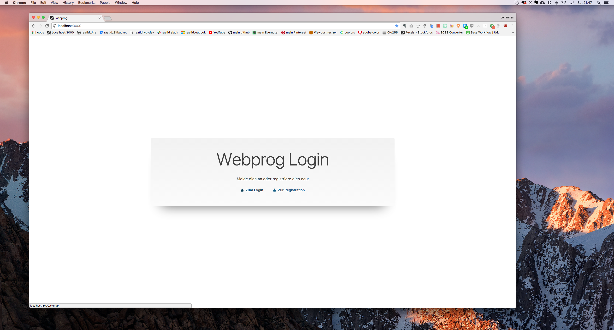
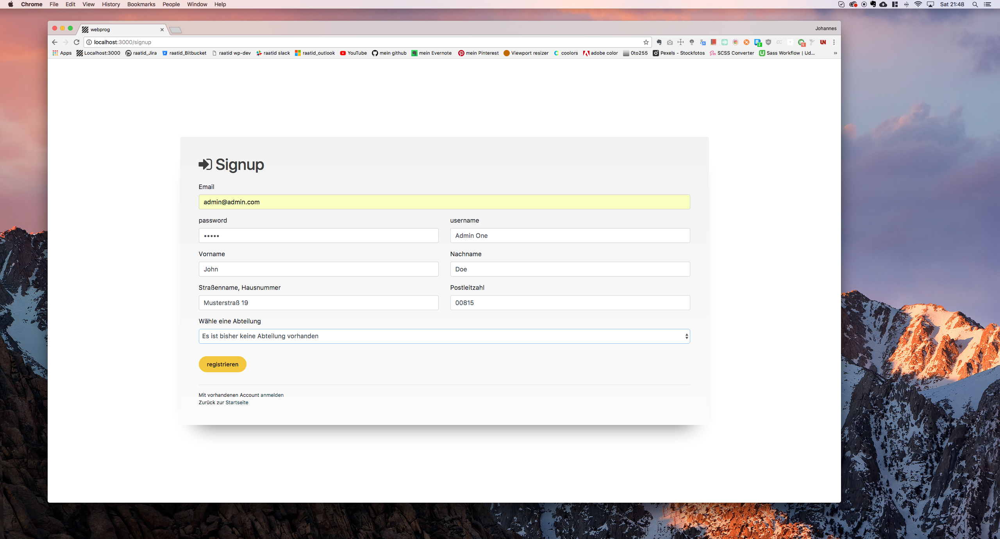

### [#](adminernennung) Admin-Ernennung
In Robo 3T kann die Datenbank visualisiert werden. Geht man auf die Collection der User kann das Objekt eines Users angepasst werden. Ändert man den Eintrag *is_admin* auf **1** besitzt der Benutzer im weiteren Verlauf Adminrechte.
Dies kann auch über die Mongo Shell im Terminal geschehen. 
mit   

```
$ show dbs
```  
  
werden die die vorhandenen Datenbanken angezeigt. Hier muss in die *webprog db* gewechselt werden.     

```
$ use webprog
```    
  
Anschließend können die Collections angezeigt werden.    

```
$ show collections
```   
  
um die user in formatierter Form anzeigen zu lassen dient folgender Befehl    

```
$ db.users.find().pretty()
```   
  
Um ein bestimmten User zu einem Admin zu machen muss die *user_id* angesprochen werden um dann *is_adim* zu modifizieren.    

```
$ db.users.update(
	{ user_id: 59cff8099f64a1223552a742 },
	{ $set: { is_admin: 1 } }
```   
Siehe auch die [MongoDB Doku](https://docs.mongodb.com/getting-started/shell/update/).

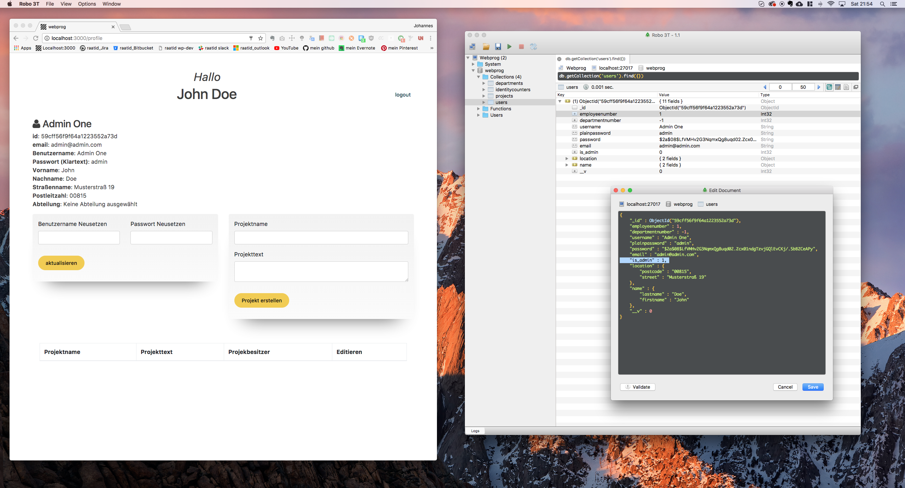
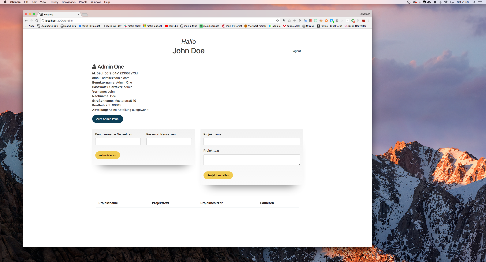
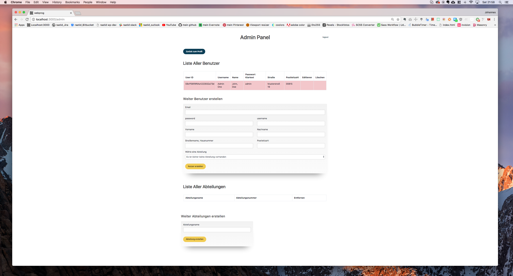
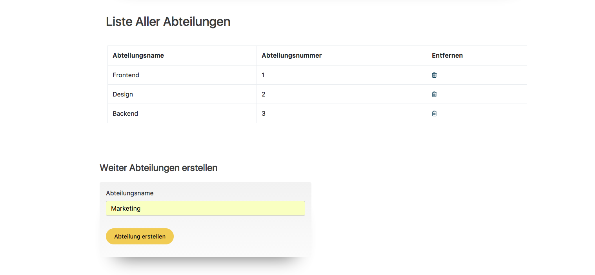
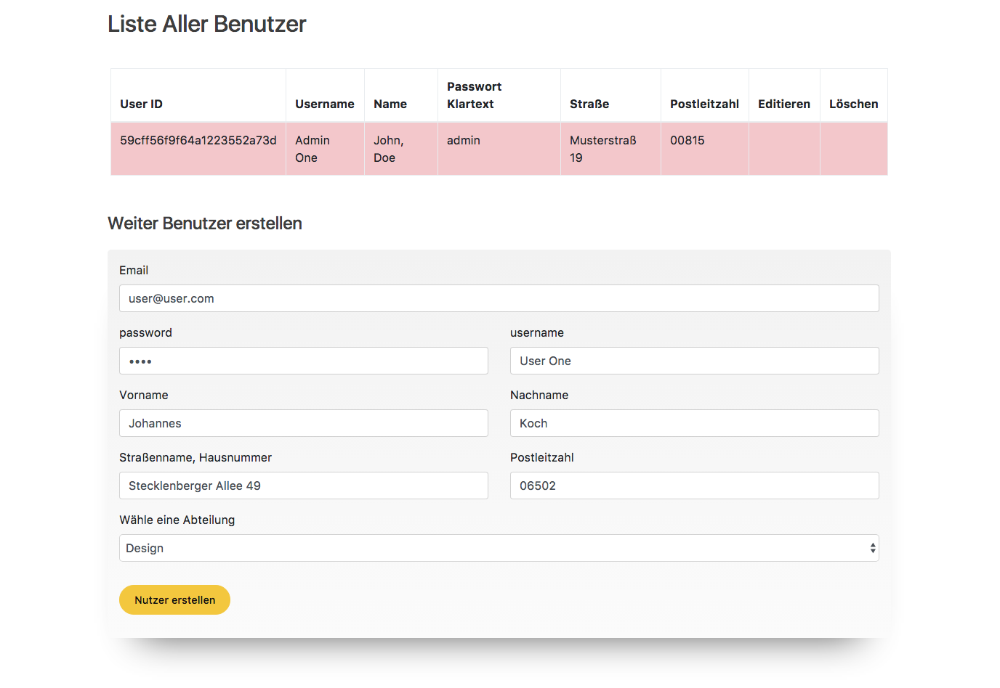
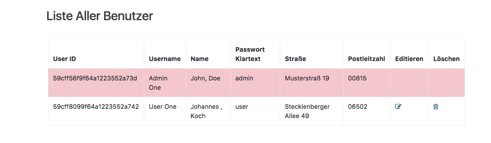
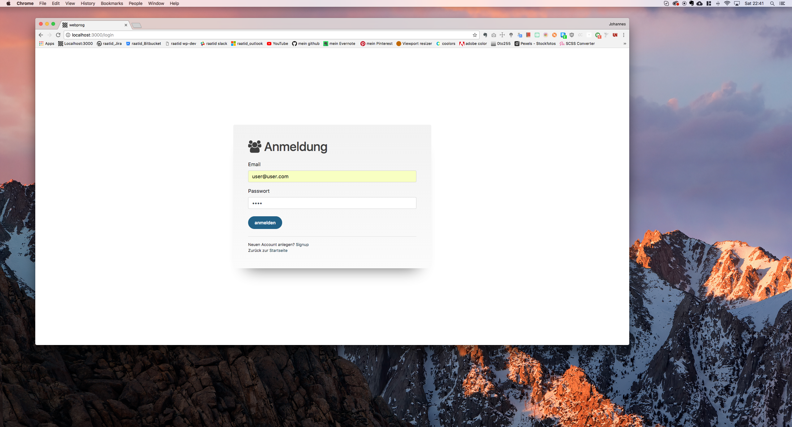
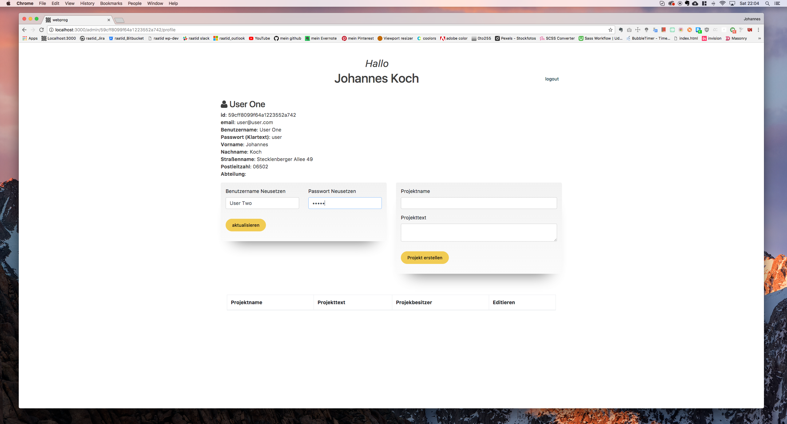
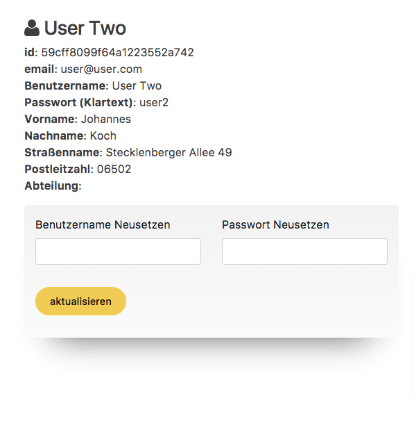
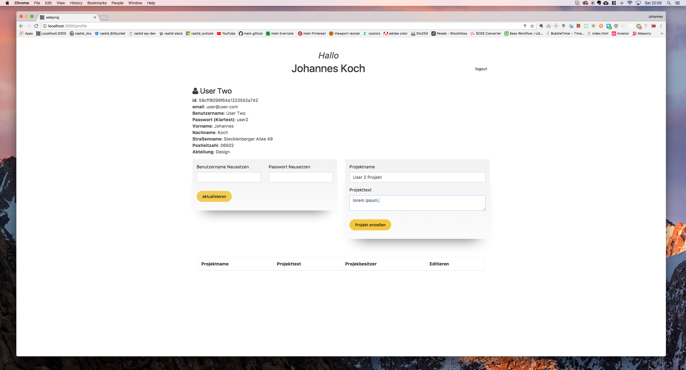
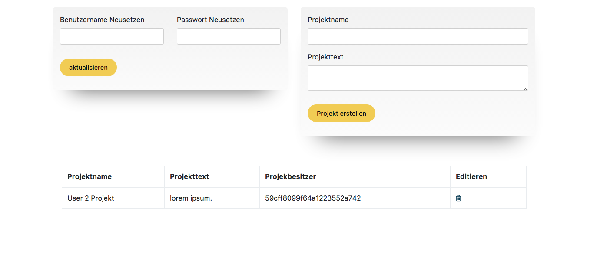


## [#](anerkennung) Anerkennung
* Chris Sevilleja - Scotch.io: [Easy Node Authentication](https://scotch.io/tutorials/easy-node-authentication-setup-and-local)
* Daniel Shiffman - The Coding Train: [Building an API with Node.js](https://www.youtube.com/watch?v=P-Upi9TMrBk&list=PLRqwX-V7Uu6Yyn-fBtGHfN0_xCtBwUkBp)
* Traversy Media: [RESTful API From Scratch](https://www.youtube.com/watch?v=eB9Fq9I5ocs)
